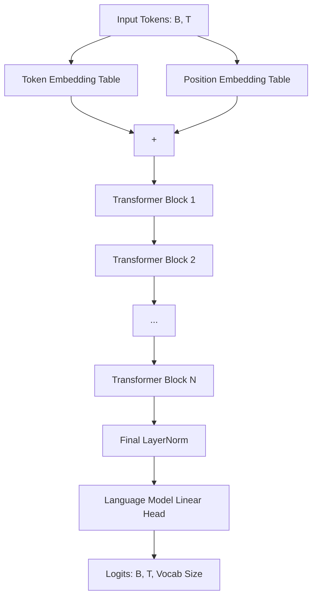

# NanoGPT: Character-Level Language Model

A clean, educational, and modular PyTorch implementation of a generative, decoder-only Transformer model (GPT), inspired by Andrej Karpathy's "Neural Networks: Zero to Hero" series. This project implements character-level text generation trained on the Tiny Shakespeare dataset, featuring real-time token streaming during generation.

---

## Project Structure

The project is structured to keep clean production/modular code separate from development prototyping and baseline models:

* **Modular Implementation**:
  * [`model.py`](file:///d:/Projects/nanogpt/model.py): Defines the core GPT architecture, including the attention mechanisms, multi-head attention, MLP/Feed-Forward networks, Transformer block, and the main `GPTLanguageModel` class with streaming generation (`stream_generate`).
  * [`train.py`](file:///d:/Projects/nanogpt/train.py): A helper training script outlining the data loading, optimizer setup, training loop, and model checkpoint saving.
  * [`main.py`](file:///d:/Projects/nanogpt/main.py): An interactive command-line interface that loads the saved model checkpoint and generates streaming completions in response to user prompts.
* **Development & Prototyping**:
  * [`dev/`](file:///d:/Projects/nanogpt/dev): Contains standalone prototyping notebooks and baseline models:
    * [`dev/bigram.py`](file:///d:/Projects/nanogpt/dev/bigram.py): A simple Bigram language model baseline used to benchmark self-attention performance.
    * [`dev/gpt-dev.ipynb`](file:///d:/Projects/nanogpt/dev/gpt-dev.ipynb): A step-by-step Jupyter Notebook building up the self-attention, multi-head attention, residual connections, and layer normalization layers from scratch.
* **Assets & Dependencies**:
  * [`dataset/input.txt`](file:///d:/Projects/nanogpt/dataset/input.txt): The Tiny Shakespeare training text corpus.
  * [`model.pt`](file:///d:/Projects/nanogpt/model.pt): Serialized model checkpoint containing trained weight parameters.
  * [`requirements.txt`](file:///d:/Projects/nanogpt/requirements.txt): List of python dependency packages.

---

## Model Architecture

The `GPTLanguageModel` is a character-level decoder-only Transformer. 



### Key Components

1. **Token and Positional Embeddings**: 
   * Input character IDs are mapped to dense vectors of dimension `n_embd`.
   * A learned absolute positional embedding table maps each position index within the context window (`block_size`) to a vector of size `n_embd`.
   * The token and positional embeddings are summed: \(x = x_{tok} + x_{pos}\).

2. **Causal Self-Attention Layer (`Head`)**:
   * Computes linear projections for Queries (\(Q\)), Keys (\(K\)), and Values (\(V\)) from the input:
     \[Q = xW_q, \quad K = xW_k, \quad V = xW_v\]
   * Attention weights (affinities) are computed as:
     \[\text{Attention}(Q, K, V) = \text{softmax}\left(\frac{QK^T}{\sqrt{d_k}} + M\right)V\]
     where \(d_k\) is the head size, and \(M\) is a causal mask matrix where \(M_{ij} = 0\) for \(i \geq j\) and \(M_{ij} = -\infty\) for \(i < j\). This causal mask prevents future tokens from influencing the current token.

3. **Multi-Head Attention (`MultiHeadAttention`)**:
   * Runs multiple causal self-attention heads in parallel.
   * Outputs from each head are concatenated along the channel dimension and projected back through a linear layer with dropout.

4. **Feed-Forward Network (`FeedForward`)**:
   * A position-wise MLP applied to each token vector individually:
     \[\text{FFN}(x) = \max(0, xW_1 + b_1)W_2 + b_2\]
   * Utilizes a hidden layer size of \(4 \times d_{model}\) with a ReLU activation and dropout.

5. **Transformer Block (`Block`)**:
   * Implements pre-layer normalization (Pre-LN) and residual connections:
     \[x^{(1)} = x + \text{MultiHeadAttention}(\text{LayerNorm}(x))\]
     \[x^{(2)} = x^{(1)} + \text{FeedForward}(\text{LayerNorm}(x^{(1)}))\]

---

## Hyperparameters

The modular architecture uses the following default configuration parameters:

| Hyperparameter | Value | Description |
| :--- | :--- | :--- |
| `block_size` | 256 | Maximum context length (T) for token prediction |
| `n_embd` | 384 | Embedding dimension (C) for token and position representations |
| `n_head` | 6 | Number of parallel attention heads |
| `n_layer` | 6 | Number of consecutive Transformer blocks |
| `dropout` | 0.2 | Dropout probability applied to attention weights, projection layers, and MLPs |
| `batch_size` | 64 | Number of training sequence batches processed in parallel |
| `learning_rate` | \(3 \times 10^{-4}\) | AdamW optimizer learning rate |

---

## Getting Started

### 1. Installation

Clone the repository and install the required dependencies (Python 3.8+ recommended):

```bash
# Install packages listed in requirements
pip install -r requirements.txt
```

### 2. Training the Model

To train the model from scratch on `dataset/input.txt`, execute `train.py`. The script tokenizes the training corpus, runs the training loop, and saves the trained parameters to `model.pt`:

```bash
python train.py
```

### 3. Running Interactive Inference

You can interact with a trained model in real-time. The `main.py` script loads the saved weights from `model.pt`, takes an arbitrary prompt, and streams character-by-character completions using token generation streaming:

```bash
python main.py
```

Example prompt session:
```txt
Loading model...
Done!
============================================================
NanoGPT Interactive
Type 'exit' to quit.
============================================================

You: ROMEO:

Model: 
ROMEO:
Hold, take this letter; early in the morning
See thou deliver it to my lord and father.
Give me the light: upon thy life, I charge thee,
Whate'er thou hear'st or seest, stand all aloof,
And do not interrupt me in my course.
...
```
